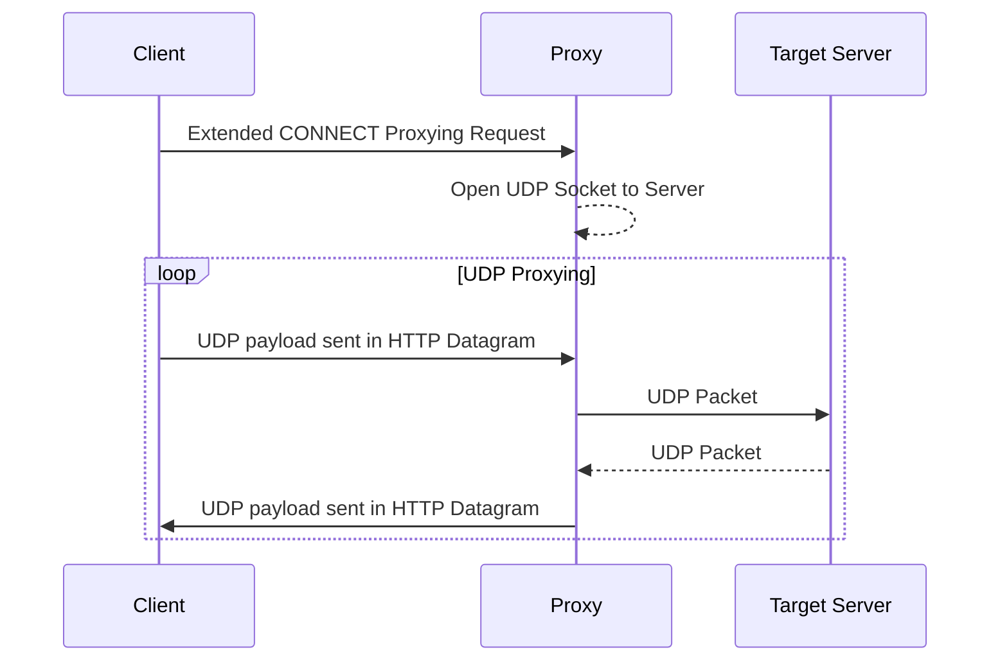

CONNECT-UDP ([RFC 9298](https://datatracker.ietf.org/doc/html/rfc9298)) enables the proxying of UDP packets over HTTP/3. It is implemented in [masque-go](https://github.com/quic-go/masque-go).

## Protocol Overview

A client establishes an HTTP/3 connection to a proxy. It requests the proxying of UDP packets to a remote server by sending an Extended CONNECT ([RFC 9220](https://datatracker.ietf.org/doc/html/rfc9220)) HTTP request. If the proxy accepts the proxying request, it opens a UDP socket to the target and forwards UDP packets between the client and the target. Between the client and the proxy, UDP datagrams are sent on the QUIC connection using HTTP Datagrams ([RFC 9279](https://datatracker.ietf.org/doc/html/rfc9279)).

