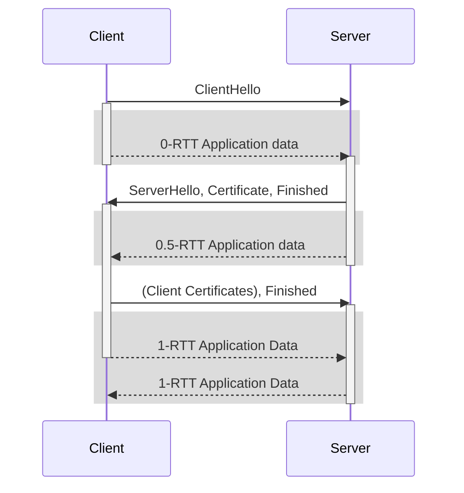

## Using a `quic.Transport`

Since QUIC uses connection IDs to demultiplex connections, multiple outgoing connections can share a single UDP socket.

```go
ctx, cancel := context.WithTimeout(context.Background(), 3*time.Second) // 3s handshake timeout
defer cancel()
conn, err := tr.Dial(ctx, <server address>, <tls.Config>, <quic.Config>)
// ... error handling
```


## Using the Convenience Functions

As a shortcut, `quic.Dial` and `quic.DialAddr` can be used without explictly initializing a `quic.Transport`:

```go
ctx, cancel := context.WithTimeout(context.Background(), 3*time.Second) // 3s handshake timeout
defer cancel()
conn, err := quic.Dial(ctx, conn, <server address>, <tls.Config>, <quic.Config>)
```

Just as we saw before when used a similar shortcut to run a server, it's also not possible to reuse the same UDP socket for other outgoing connections, or to listen for incoming connections.


## TLS Session Resumption {#tls-session-resumption}

Just as a TLS client running on top of a TCP connection, a QUIC client can also use [TLS session resumption](https://datatracker.ietf.org/doc/html/rfc8446#section-2.2). Session resumption allows the skipping of certain parts of the TLS handshake. For example, the server doesn't need to send its certificate again.

To use session resumption, nothing needs to be done on the QUIC layer. It is enabled the same way as when using the standard library TLS over TCP, i.e. by settings the `tls.Config.ClientSessionCache`.


## 0-RTT

QUIC's 0-RTT feature allows the client to send application data right away when resuming a connection to a server to which it connected before. Application data is sent before the handshake with the server completes.




A client can use 0-RTT session resumption if a few conditions are met on the client side:
1. It needs to use [TLS session resumption](#tls-session-resumption). There's no way to use 0-RTT without a TLS session ticket.
2. The server's support for session resumption, indicated by the session ticket issued on the initial connection, must be present.
3. The ALPN (configured using `tls.Config.NextProtos`) on the new connection must be the same.


  Due to the design of the TLS protocol, clients cannot directly request session tickets or unilaterally enable 0-RTT. These capabilities depend on the server's configuration and support.


To dial a 0-RTT connection, use `DialEarly` instead of `Dial`. quic-go performs the checks for the conditions listed above and dials a 0-RTT connection if they are met.

```go
ctx, cancel := context.WithTimeout(context.Background(), 3*time.Second)
defer cancel()
tlsConf := &tls.Config{
  ClientSessionCache: tls.NewLRUClientSessionCache(100),
}
// 1. Use this tls.Config to establish the first connection to the server
// and receive a session ticket ...
// 2. Dial another connection to the same server
conn, err := tr.DialEarly(ctx, <server address>, tlsConf, <quic.Config>)
// ... error handling
// Check if 0-RTT is being used
uses0RTT := conn.ConnectionState().Used0RTT
// If 0-RTT was used, DialEarly returned immediately.
// Open a stream and send some application data in 0-RTT ...
str, err := conn.OpenStream()
```

When performing a 0-RTT session resumption, the same [flow control limits]() apply to the resumed session as to the original session, both in terms of the amount of data that can be sent on streams and the total number of streams that can be opened. quic-go achieves this by storing these values in the `tls.SessionState` associated with the session ticket.


  Clients need to handle the possibility of servers rejecting 0-RTT handshakes, as outlined in [Dealing with Rejections](#0rtt-rejection).

  This adds some complexity to the use of 0-RTT, but it is imperative to correctly handle this case, as the server might reject 0-RTT for any reason.



### Security Properties of 0-RTT

As described in [Section 8 of RFC 8446](https://datatracker.ietf.org/doc/html/rfc8446#section-8), application data sent in 0-RTT (what TLS 1.3 calls "Early Data") has different security properties than application data sent after completion of the handshake. 0-RTT data is encrypted, and an observer won't be able to decrypt it. However, since data is sent before the client has received any fresh key material from the server, an attacker can record the 0-RTT data and replay it to the server at a later point, or to a different server in a load-balanced server deployment.

In general it is only safe to perform idempotent actions in 0-RTT. It is the client's responsibility to make sure that the data it sends is appropriate to send in 0-RTT. For many application protocols, this means limiting to the use of 0-RTT to certain kinds of data, and delaying the sending of other data until the handshake has completed.

This can easily be accomplished by blocking on the channel returned by `HandshakeComplete`.
```go
select {
case <-conn.HandshakeComplete():
  // Handshake complete.
  // All data sent from here on is protected against replay attacks.
case <-conn.Context().Done():
  // Handshake failed.
}
```


### Dealing with Rejections {#0rtt-rejection}

The server can reject a 0-RTT connection attempt for various reasons. When 0-RTT is rejected, this doesn't lead to a failure of the QUIC handshake. Instead, the handshake proceeds as if it were a [session resumption](#tls-session-resumption) without 0-RTT.

Servers might reject 0-RTT due to:
* Incompatible changes in flow control parameters.
* Differences in the application protocol (negotiated using ALPN) from the initial connection.
* Server load, opting not to process 0-RTT packets at the time.

As mentioned above, the client applies the flow control limits used on the initial connection to the resumed connection. For example, if the server was reconfigured after the initial connection, reducing the flow control limits, the client might unknowingly exceed these new limits. This scenario is a common reason for 0-RTT rejection.

Upon rejecting 0-RTT, the server discards all 0-RTT packets sent by the client. This results in the invalidation of all opened streams and any data sent. quic-go does not automatically retransmit data sent in 0-RTT after completion of the handshake. It's the application's responsibility to detect this error and respond appropriately.

The `quic.Connection` returned by `DialEarly` behaves as if it had been [closed](): all calls to `OpenStream`, `AcceptStream`, as well as `Read` and `Write` calls on streams return a `quic.Err0RTTRejected`. **However, the underlying QUIC connection remains open**, it is only used as a signal to the application that all data sent so far was not processed by the server. To continue communication, the application can transition to using `NextConnection`:

```go
conn, err := tr.DialEarly(ctx, <server address>, <tls.Config>, <quic.Config>)
// ... error handling
_, err :=conn.AcceptStream()
if errors.Is(err, quic.Err0RTTRejected) {
  // The server rejected 0-RTT. None of the data sent so far was processed.
  newConn := conn.NextConnection()
}
```


## 📝 Future Work

* Mitigate [Performance Impact of Large Certificates]() by sending two ClientHellos: [#3775](https://github.com/quic-go/quic-go/issues/3775)
* Happy Eyeballs for `DialAddr`: [#3772](https://github.com/quic-go/quic-go/issues/3772)
