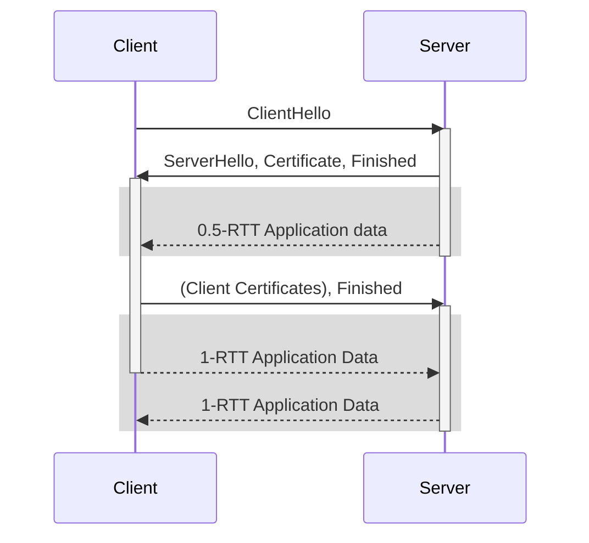
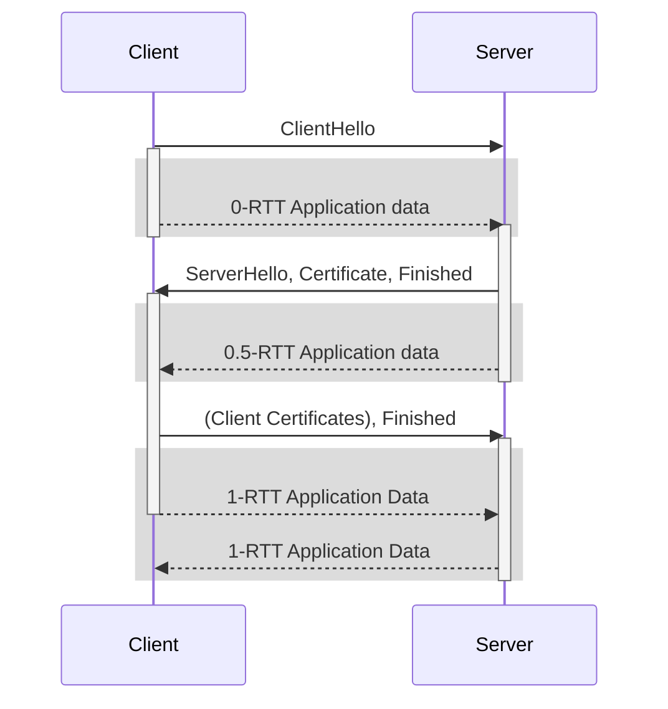

## Using a `quic.Transport`

The central entry point is the `quic.Transport`. A `Transport` manages all QUIC connections running on a single UDP socket. Since QUIC uses Connection IDs, it can demultiplex a listener (accepting incoming connections) and an arbitrary number of outgoing QUIC connections on the same UDP socket.

```go
udpConn, err := net.ListenUDP("udp4", &net.UDPAddr{Port: 1234})
// ... error handling
tr := quic.Transport{
  Conn: udpConn,
}
ln, err := tr.Listen(tlsConf, quicConf)
// ... error handling
for {
  conn, err := ln.Accept()
  // ... error handling
  // handle the connection, usually in a new Go routine
}
```

The listener `ln` can now be used to accept incoming QUIC connections by (repeatedly) calling the `Accept` method (see below for more information on the `quic.Connection`).

This listener can be closed independently from the underlying transport. Connections that are already established and accepted won't be affected, but clients won't be able to establish new connections.


## Using the Convenience Functions

As a shortcut, `quic.Listen` and `quic.ListenAddr` can be used without explicitly initializing a `quic.Transport`:

```go
ln, err := quic.Listen(udpConn, tlsConf, quicConf)
```

When using the shortcut, it's not possible to reuse the same UDP socket for outgoing connections.


  While closing the listener associated with a `Transport` doesn't close QUIC connections accepted from this listener, closing a listener created using these shortcuts causes all accepted connections to be immediately terminated.


## Certificate Size Considerations {#cert-size}

During the initial phase of the QUIC handshake, before validating the client's address, server response size is restricted to thrice the bytes received from the client, as outlined in [RFC 9000, Section 8](https://datatracker.ietf.org/doc/html/rfc9000#name-address-validation). This limitation helps prevent the use of QUIC servers in DDoS attack amplifications by ensuring a server cannot send an excessively large response to a potentially spoofed packet.

Given that the initial client packet is typically 1200 bytes, the server's response is capped at 3600 bytes. This cap includes the server's TLS certificate in its first response, and an oversized certificate can extend the handshake by an additional RTT. As large certificates are commonplace, optimizing the certificate chain's size is advisable to avoid handshake delays, supported by insights from [Fastly's research](https://www.fastly.com/blog/quic-handshake-tls-compression-certificates-extension-study).


## 0.5-RTT {#05-rtt}

The following diagram shows a (simplified) sequence diagram of the TLS handshake messages exchanged during the QUIC handshake, and at which place handshake data can be sent by both endpoints.



The server can send application data in its first flight, right after it has sent the TLS ServerHello and the Certificate. Since this happens right after receiving the ClientHello (which takes half a network roundtrip time after the client sent it), this is called 0.5-RTT data.


  0.5-RTT data is encrypted with the same keys that all data sent later is sent with. However, at this point in the handshake, the server has not yet received the client's TLS certificate (if TLS client authentication is used). It's important for implementations to avoid sending sensitive data to unauthenticated clients.


A connection can be accepted at this early stage by using `ListenEarly` instead of `Listen`: 

```go
ln, err := tr.ListenEarly(tlsConf, quicConf)
// ... error handling
conn, err := ln.Accept()
// ... error handling
go func() {
  // It is now possible to open streams and send data in 0.5-RTT data
  str, err := conn.OpenStream()
  // ... error handling

  // Optionally, wait for the handshake to complete
  select {
  case <-conn.HandshakeComplete():
    // handshake completed
  case <-conn.Context().Done():
    // connection closed before handshake completion, e.g. due to handshake failure
  }
}()
```

As soon as the connection is accepted, it can open streams and send application data. If [datagram support]() is negotiated, datagrams can be sent as well.

At any point, the application can wait for completion of the handshake by blocking on the channel returned by `Connection.HandshakeComplete()`.


## 0-RTT

From the server's perspective, accepting 0-RTT connection looks very similar to accepting a 0.5-RTT connection.
The main difference is that with 0-RTT, the client is able to open streams right away, which can be accepted using `AcceptStream`.



To allow clients to use 0-RTT resumption, the `Allow0RTT` flag needs to be set on the `quic.Config`.

```go
quicConf := &quic.Config{Allow0RTT: true}
ln, err := tr.ListenEarly(tlsConf, quicConf)
// ... error handling
conn, err := ln.Accept()
// ... error handling
go func() {
  // It is now possible to accept the streams which the client opened in 0-RTT.
  str, err := conn.AcceptStream()
  // ... error handling

  // Optionally, wait for the handshake to complete
  select {
  case <-conn.HandshakeComplete():
    // handshake completed
  case <-conn.Context().Done():
    // connection closed before handshake completion, e.g. due to handshake failure
  }
}()
```

It is possible to inspect the `quic.ConnectionState` to find out if a connection used 0-RTT resumption:
```go
used0RTT := conn.ConnectionState().Used0RTT
```


## 📝 Future Work

* Call `GetConfigForClient` after processing the ClientHello: [#3862](https://github.com/quic-go/quic-go/issues/3862)
* Save the RTT measurement in the resumption token (not the session ticket): [#4158](https://github.com/quic-go/quic-go/issues/4158)
